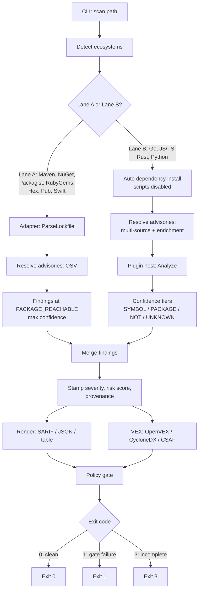
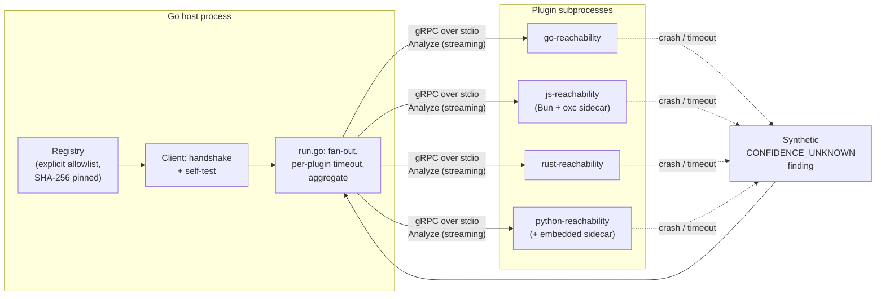

# System Architecture

`commit0-analyzer` is a thin Go **host** that orchestrates language-specific
**reachability plugins** over a versioned, frozen-at-runtime contract.
Advisory data, risk scoring, and rendering all live host-side; reachability
*reasoning* lives only inside the plugin processes. For a directory-level
file map, see [`docs/codebase-summary.md`](./codebase-summary.md).

## Scan pipeline



**Lane A** (lockfile-static, no plugin process): Maven, NuGet, Packagist,
RubyGems, Hex, Pub, SwiftPM. Each ecosystem's `LaneAAdapter` parses only the
lockfile (`gradle.lockfile`, `packages.lock.json`, `composer.lock`,
`Gemfile.lock`, `mix.lock`/`rebar.lock`, `pubspec.lock`,
`Package.resolved`) — manifests are read for direct-dependency hints only and
are never executed. Reachability tops out at `PACKAGE_REACHABLE`; a
declared-only manifest without a lockfile is always incomplete.

**Lane B** (plugin-backed): Go, JavaScript/TypeScript, Rust, Python. The host
auto-installs dependencies (lifecycle/build scripts always disabled) unless
`--skip-deps-install` or `--offline`, then dispatches to a reachability
plugin over gRPC. All four tiers are reachable, up to `SYMBOL_REACHABLE` for
Go and Python (and JS/TS with `--symbols`).

Both lanes feed the same downstream pipeline: merge → severity/risk stamping
→ render → VEX → policy gate → exit code. Full flag semantics for each stage
are in [`docs/usage.md`](./usage.md).

## Plugin host & trust boundary



- **Transport:** `hashicorp/go-plugin`, gRPC over stdio only (the net/rpc
  transport is stubbed to error). Every plugin runs as a separate OS
  subprocess.
- **Handshake:** a magic cookie (`commit0-analyzer-v0-plugin`) is a UX guard
  against launching an unrelated executable, not the integrity mechanism.
  The `Metadata` RPC checks the protocol version and doubles as a self-test —
  a plugin returning an empty `Metadata.Name` is rejected.
- **Trust boundary:** plugins load only from an **explicit allowlist**
  (`internal/host/registry.go`) — there is no PATH or conventional-path
  discovery by design. The registry rejects relative paths, non-regular
  files, and world-writable path components (a TOCTOU guard, with a
  sticky-bit exemption). Each manifest additionally pins a **SHA-256 hash**
  of the main binary and every additional artifact (e.g. the JS plugin's
  oxc `.node` sidecar); go-plugin's `SecureConfig` re-hashes at exec time.
  Note: the self-build flow (building a plugin from source on demand) hashes
  the just-built artifact, which closes the TOCTOU window but does not by
  itself guarantee supply-chain provenance of the source that was built.
- **Crash/timeout handling:** `internal/host/run.go` kills the OS process,
  drains and closes the gRPC stream, and emits a synthetic
  `CONFIDENCE_UNKNOWN` finding — plugin failure degrades coverage to
  "unknown," it never silently drops it.

### Plugin contract compatibility

The contract is versioned independently of the product (`pkg/contract
/version.go`) and is currently `v0-PROVISIONAL` (`ProtocolMajor = 0`). The
host's acceptance rule:

```
accept iff plugin.Major == host.Major AND plugin.Minor <= host.Minor
```

A plugin reporting a higher minor version, or any major-version mismatch, is
rejected at handshake time. See
[`docs/project-roadmap.md`](./project-roadmap.md) for the v1 contract-freeze
status.

## Confidence-tier semantics

| Tier | Enum value | Meaning | Suppressible? | Gates by default? |
|---|---|---|---|---|
| `SYMBOL_REACHABLE` | 3 | A concrete call-graph path from an entry point to the vulnerable symbol was found; `ReachabilityPath` is populated. | No | Yes |
| `PACKAGE_REACHABLE` | 2 | The vulnerable package is imported/declared and reachable, but symbol-level confirmation is unavailable or not applicable. | No | Yes |
| `NOT_REACHABLE` | 1 | No path from any entry point to the vulnerable symbol/package was found by a *complete* analysis. | **Yes — the only suppressible tier** | No (VEX `not_affected` when complete) |
| `UNKNOWN` | 0 (zero value, conservative default) | Reachability could not be determined (build failure, dynamism, timeout, crash, missing data). | No | Yes (by default; see `--gate-on`) |

`contract.FindingWrapper.IsSuppressible()` is the single point in the
codebase that enforces "only `NOT_REACHABLE` may suppress." An incomplete
`NOT_REACHABLE` (partial analysis) is treated as `UNKNOWN` for gating and VEX
purposes, never as a proven suppression. See
[`docs/soundness-limits.md`](./soundness-limits.md) for the exhaustive list
of what forces `UNKNOWN` per ecosystem.

## Advisory pipeline

1. **Fetch** — up to five sources composed via `MultiSource`: Go
   vulnerability database (`vuln.go.dev`, the only symbol-level source),
   OSV.dev (per-ecosystem bundles, zip-bomb guarded), GHSA (offline OSV
   bundle + optional live GitHub GraphQL when `GITHUB_TOKEN` is set),
   GitLab gemnasium-db (defaults to the MIT-licensed community mirror), and
   opt-in NVD (CPE-keyed, non-gating breadth matches).
2. **Merge/dedup** — advisories are grouped by alias-equivalence
   (`{ID} ∪ Aliases`, transitive closure); the representative is chosen by
   symbol-level data > wider affected range > higher source trust >
   lexicographic ID. Conflicts fold fail-safe: severity takes the max across
   sources, ranges union, `Withdrawn` requires unanimous agreement across
   contributing sources, and `Incomplete` is OR'd (any incomplete input
   makes the merged advisory incomplete).
3. **Enrich** — CVSS scoring (exact v3.0/3.1; v4 captured losslessly),
   authoritative NVD CVSS/CWE (joined by CVE alias, can only raise severity,
   never adds new package edges), CISA KEV, FIRST EPSS, and CWE
   normalization.
4. **Compare versions** — a tri-state comparator per ecosystem returns
   `VersionAffected | VersionNotAffected | VersionUndecidable`; any parse
   error or unregistered ecosystem resolves to `VersionUndecidable` and is
   forwarded with `Incomplete = true`, never silently treated as
   not-affected.
5. **Score risk** — a pure function of reachability, CVSS, KEV, and EPSS
   (`internal/advisory/risk.go`): `NOT_REACHABLE` scores `0`; a KEV-listed
   reachable finding is boosted into the top band; a reachability floor
   ensures a reachable finding is never demoted to "ignore" by missing
   enrichment data.

## Render & VEX

- **SARIF 2.1.0** (`internal/render/sarif.go`) — the default output format.
  `codeFlows` appears only when at least one call step exists (an empty
  `threadFlow` is schema-invalid). `NOT_REACHABLE` findings become SARIF
  *suppressed* results with a justification, not omitted results. Risk score
  maps to SARIF `rank`.
- **VEX** (`internal/vex/`) — one internal status model, three formatters
  (OpenVEX, CycloneDX-VEX, CSAF 2.0). Status mapping:
  `NOT_REACHABLE` (complete) → `not_affected`; any reachable tier →
  `affected`; `UNKNOWN` or any incomplete analysis → `under_investigation`.
  Deterministic by construction — content-derived SHA-256 document IDs, no
  `time.Now()`/random UUIDs inside the emitters.

## Policy gate & exit codes

`internal/policy/` evaluates, in order: skip non-gate-eligible findings →
skip explicitly ignored findings → gate if the finding meets the configured
confidence/severity threshold or an additive risk predicate (`kev`,
`epss>=X`, `risk>=Y`). `NOT_REACHABLE` never gates.

Exit-code precedence (`internal/policy/exit.go`):

| Exit | Meaning | Precedence |
|---|---|---|
| `1` | Gate failure — one or more findings exceeded the configured threshold. | Highest — a gate failure exits `1` even if the scan is also incomplete. |
| `3` | Incomplete/operational error — plugin crash, build failure, missing deps, advisory fetch failure, or a recovered panic, with no gate-failing finding. | Middle. |
| `0` | Clean — scan completed and every finding is within policy. | Lowest — only reachable when the scan is both complete and policy-clean. |

Exit code `2` is intentionally never used, to avoid colliding with Go
runtime panic exit codes and `govulncheck`'s own exit-code convention.

## CI pipeline

`.github/workflows/ci.yml` is the repository's only workflow. A `changes` job
path-filters which heavy jobs run (so docs-only changes skip build/test/proto
entirely); a `proto` job checks for generated-stub drift whenever
`proto/**`/`buf.yaml`/`buf.gen.yaml`/`pkg/contract/commit0v1/**` change
(`buf generate` + `git diff`); `build-test` runs `go vet`, `go test` (with
`-race` on `main` only), and `golangci-lint`; `js-test` runs `tsc`, `vitest`,
and the corpus harness; `js-e2e` runs plugin + host integration tests. A `ci`
aggregate job is the single required branch-protection status check, and
stays green when a sub-job is correctly skipped by the path filter.
